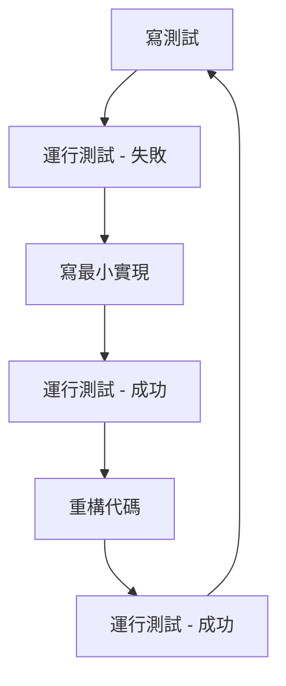

# VDD SDK TDD 實施指南

## 🎯 **TDD 實施時機**

### ✅ **現在就是開始 TDD 的最佳時機！**

**原因分析：**
1. **API 設計已完成** - 我們有清晰的接口定義
2. **實現尚未完成** - 大部分功能還是骨架實現
3. **架構清晰** - 模塊邊界明確，便於測試
4. **風險可控** - 早期發現問題成本最低

## 📋 **TDD 實施策略**

### 1. **測試金字塔結構**

```
    /\
   /  \     E2E 測試 (5%)
  /____\    
 /      \   集成測試 (15%)
/________\  
/          \ 單元測試 (80%)
/____________\
```

### 2. **測試分類**

#### **單元測試 (80%)**
- ✅ **API 函數測試** - 測試所有公共 API
- ✅ **模擬測試** - 使用 Google Mock 測試邊界條件
- ✅ **錯誤處理測試** - 測試各種錯誤情況

#### **集成測試 (15%)**
- ✅ **端到端工作流程** - 完整的使用場景
- ✅ **會話管理** - 租約機制和心跳
- ✅ **多顯示器管理** - 複雜配置場景

#### **E2E 測試 (5%)**
- ✅ **性能測試** - 基準測試和壓力測試
- ✅ **兼容性測試** - 不同系統環境
- ✅ **恢復測試** - 故障恢復機制

## 🚀 **TDD 工作流程**

### **Red-Green-Refactor 循環**



### **具體實施步驟**

#### **階段 1：基礎測試框架**
```bash
# 1. 設置測試環境
mkdir build
cd build
cmake .. -DBUILD_TESTS=ON
cmake --build . --config Release

# 2. 運行基礎測試
./bin/vddsdk_tests.exe --gtest_filter="*ApiTest*"
```

#### **階段 2：核心功能測試**
```cpp
// 測試初始化功能
TEST_F(VddSdkApiTest, InitializeAndShutdown) {
    Status status = Initialize(m_config);
    EXPECT_EQ(status, Status::Ok);
    
    status = Shutdown();
    EXPECT_EQ(status, Status::Ok);
}
```

#### **階段 3：模擬測試**
```cpp
// 測試服務連接
TEST_F(VddSdkMockTest, ServiceConnectionSuccess) {
    EXPECT_CALL(*m_mockService, IsConnected())
        .WillRepeatedly(Return(true));
    
    Initialize(m_config);
    // 驗證服務連接狀態
}
```

#### **階段 4：集成測試**
```cpp
// 測試完整工作流程
TEST_F(VddSdkIntegrationTest, CompleteWorkflow) {
    Initialize(m_config);
    Activate(desc, 1);
    ConfigureDisplay();
    Deactivate();
    Shutdown();
}
```

## 📊 **測試覆蓋率目標**

### **代碼覆蓋率**
- **單元測試**: 90%+ 行覆蓋率
- **分支覆蓋率**: 85%+ 分支覆蓋率
- **函數覆蓋率**: 95%+ 函數覆蓋率

### **功能覆蓋率**
- **API 覆蓋率**: 100% 公共 API
- **場景覆蓋率**: 100% 設計文檔中的場景
- **錯誤覆蓋率**: 90%+ 錯誤情況

## 🔧 **測試工具和框架**

### **測試框架**
- **Google Test** - 單元測試框架
- **Google Mock** - 模擬測試框架
- **CMake/CTest** - 測試運行和報告

### **測試配置**
```json
{
  "test_categories": {
    "unit_tests": {
      "enabled": true,
      "timeout_seconds": 30,
      "parallel_execution": true
    },
    "integration_tests": {
      "enabled": true,
      "timeout_seconds": 60,
      "require_driver": false
    }
  }
}
```

## 📈 **測試指標和基準**

### **性能基準**
- **初始化時間**: < 100ms
- **顯示器創建**: < 500ms
- **模式切換**: < 200ms
- **會話心跳**: < 50ms

### **可靠性基準**
- **成功率**: > 99%
- **錯誤恢復**: < 5s
- **內存洩漏**: 0 洩漏
- **資源清理**: 100% 清理

## 🎯 **TDD 最佳實踐**

### **1. 測試命名規範**
```cpp
// 格式: TestClassName_TestMethodName_ExpectedBehavior
TEST_F(VddSdkApiTest, Initialize_WithValidConfig_ReturnsOk)
TEST_F(VddSdkMockTest, ServiceConnection_WhenUnavailable_ReturnsError)
```

### **2. 測試結構 (AAA 模式)**
```cpp
TEST_F(VddSdkApiTest, ActivateDisplay) {
    // Arrange - 準備測試數據
    VirtualDisplayDesc desc;
    desc.name = "Test Display";
    desc.preferredMode = { 1920, 1080, 60, 1 };
    
    // Act - 執行被測試的操作
    Status status = Activate(desc, 1);
    
    // Assert - 驗證結果
    EXPECT_EQ(status, Status::Ok);
    EXPECT_TRUE(IsActive());
}
```

### **3. 模擬測試最佳實踐**
```cpp
// 設置期望
EXPECT_CALL(*m_mockService, SendCommand(_, _))
    .WillOnce(Return(Status::Ok))
    .WillOnce(Return(Status::Timeout));

// 驗證調用
EXPECT_CALL(*m_mockService, IsConnected())
    .Times(AtLeast(1));
```

## 🚨 **常見 TDD 陷阱和解決方案**

### **陷阱 1：測試過於複雜**
**問題**: 測試代碼比被測試代碼還複雜
**解決**: 保持測試簡單，一個測試只驗證一個行為

### **陷阱 2：依賴外部服務**
**問題**: 測試依賴於實際的驅動程序或服務
**解決**: 使用模擬對象，隔離外部依賴

### **陷阱 3：測試不穩定**
**問題**: 測試結果不確定，時而通過時而失敗
**解決**: 消除時間依賴，使用固定的測試數據

### **陷阱 4：測試覆蓋率虛高**
**問題**: 高覆蓋率但沒有測試關鍵邏輯
**解決**: 關注分支覆蓋率和邊界條件

## 📋 **TDD 檢查清單**

### **開發前**
- [ ] 理解需求和設計
- [ ] 識別測試邊界
- [ ] 準備測試數據
- [ ] 設置測試環境

### **開發中**
- [ ] 先寫測試，後寫實現
- [ ] 保持測試簡單
- [ ] 使用有意義的測試名稱
- [ ] 驗證所有邊界條件

### **開發後**
- [ ] 運行所有測試
- [ ] 檢查測試覆蓋率
- [ ] 重構代碼
- [ ] 更新文檔

## 🎉 **TDD 成功指標**

### **技術指標**
- ✅ 測試通過率: 100%
- ✅ 代碼覆蓋率: > 90%
- ✅ 測試執行時間: < 5 分鐘
- ✅ 測試穩定性: 100%

### **業務指標**
- ✅ 缺陷發現率: 早期發現 80%+ 問題
- ✅ 重構信心: 100% 安全重構
- ✅ 文檔質量: 測試即文檔
- ✅ 團隊效率: 開發速度提升 30%+

## 🚀 **下一步行動**

### **立即開始**
1. **設置測試環境** - 安裝 Google Test 和 CMake
2. **運行現有測試** - 驗證測試框架工作正常
3. **編寫第一個測試** - 從最簡單的功能開始
4. **實施 TDD 循環** - 遵循 Red-Green-Refactor

### **持續改進**
1. **監控測試指標** - 覆蓋率、執行時間、穩定性
2. **優化測試性能** - 並行執行、測試數據管理
3. **擴展測試場景** - 添加更多邊界條件
4. **自動化測試** - CI/CD 集成

---

**記住**: TDD 不是銀彈，但它是一個強大的工具。關鍵是堅持實踐，不斷改進，讓測試成為開發過程的自然組成部分。
