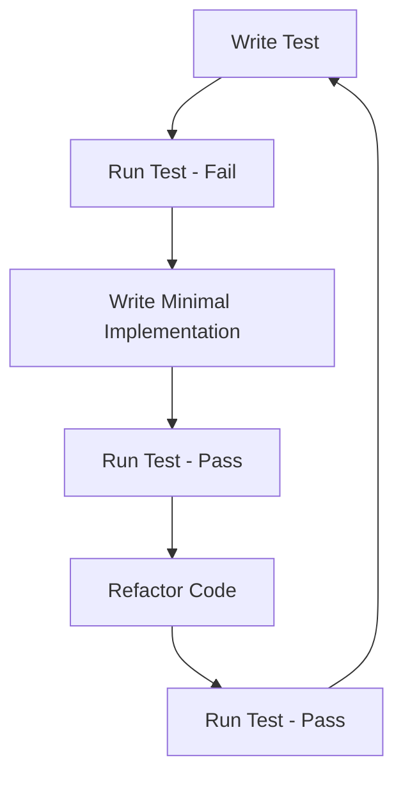

# VDD SDK TDD Implementation Guide

## 🎯 **TDD Implementation Timing**

### ✅ **Now is the best time to start TDD!**

**Reason Analysis:**
1. **API design is complete** - We have clear interface definitions
2. **Implementation is not complete** - Most functionality is still skeleton implementation
3. **Architecture is clear** - Module boundaries are clear, easy to test
4. **Risk is controllable** - Early problem discovery has lowest cost

## 📋 **TDD Implementation Strategy**

### 1. **Test Pyramid Structure**

```
    /\
   /  \     E2E Tests (5%)
  /____\    
 /      \   Integration Tests (15%)
/________\  
/          \ Unit Tests (80%)
/____________\
```

### 2. **Test Categories**

#### **Unit Tests (80%)**
- ✅ **API function tests** - Test all public APIs
- ✅ **Mock tests** - Use Google Mock to test boundary conditions
- ✅ **Error handling tests** - Test various error scenarios

#### **Integration Tests (15%)**
- ✅ **End-to-end workflows** - Complete usage scenarios
- ✅ **Session management** - Lease mechanism and heartbeat
- ✅ **Multi-display management** - Complex configuration scenarios

#### **E2E Tests (5%)**
- ✅ **Performance tests** - Benchmark and stress tests
- ✅ **Compatibility tests** - Different system environments
- ✅ **Recovery tests** - Fault recovery mechanisms

## 🚀 **TDD Workflow**

### **Red-Green-Refactor Cycle**



### **Specific Implementation Steps**

#### **Phase 1: Basic Test Framework**
```bash
# 1. Set up test environment
mkdir build
cd build
cmake .. -DBUILD_TESTS=ON
cmake --build . --config Release

# 2. Run basic tests
./bin/vddsdk_tests.exe --gtest_filter="*ApiTest*"
```

#### **Phase 2: Core Function Tests**
```cpp
// Test initialization functionality
TEST_F(VddSdkApiTest, InitializeAndShutdown) {
    Status status = Initialize(m_config);
    EXPECT_EQ(status, Status::Ok);
    
    status = Shutdown();
    EXPECT_EQ(status, Status::Ok);
}
```

#### **Phase 3: Mock Tests**
```cpp
// Test service connection
TEST_F(VddSdkMockTest, ServiceConnectionSuccess) {
    EXPECT_CALL(*m_mockService, IsConnected())
        .WillRepeatedly(Return(true));
    
    Initialize(m_config);
    // Verify service connection status
}
```

#### **Phase 4: Integration Tests**
```cpp
// Test complete workflow
TEST_F(VddSdkIntegrationTest, CompleteWorkflow) {
    Initialize(m_config);
    Activate(desc, 1);
    ConfigureDisplay();
    Deactivate();
    Shutdown();
}
```

## 📊 **Test Coverage Goals**

### **Code Coverage**
- **Unit tests**: 90%+ line coverage
- **Branch coverage**: 85%+ branch coverage
- **Function coverage**: 95%+ function coverage

### **Feature Coverage**
- **API coverage**: 100% public APIs
- **Scenario coverage**: 100% scenarios in design document
- **Error coverage**: 90%+ error scenarios

## 🔧 **Test Tools and Frameworks**

### **Test Frameworks**
- **Google Test** - Unit test framework
- **Google Mock** - Mock test framework
- **CMake/CTest** - Test execution and reporting

### **Test Configuration**
```json
{
  "test_categories": {
    "unit_tests": {
      "enabled": true,
      "timeout_seconds": 30,
      "parallel_execution": true
    },
    "integration_tests": {
      "enabled": true,
      "timeout_seconds": 60,
      "require_driver": false
    }
  }
}
```

## 📈 **Test Metrics and Benchmarks**

### **Performance Benchmarks**
- **Initialization time**: < 100ms
- **Display creation**: < 500ms
- **Mode switching**: < 200ms
- **Session heartbeat**: < 50ms

### **Reliability Benchmarks**
- **Success rate**: > 99%
- **Error recovery**: < 5s
- **Memory leaks**: 0 leaks
- **Resource cleanup**: 100% cleanup

## 🎯 **TDD Best Practices**

### **1. Test Naming Conventions**
```cpp
// Format: TestClassName_TestMethodName_ExpectedBehavior
TEST_F(VddSdkApiTest, Initialize_WithValidConfig_ReturnsOk)
TEST_F(VddSdkMockTest, ServiceConnection_WhenUnavailable_ReturnsError)
```

### **2. Test Structure (AAA Pattern)**
```cpp
TEST_F(VddSdkApiTest, ActivateDisplay) {
    // Arrange - Prepare test data
    VirtualDisplayDesc desc;
    desc.name = "Test Display";
    desc.preferredMode = { 1920, 1080, 60, 1 };
    
    // Act - Execute the operation being tested
    Status status = Activate(desc, 1);
    
    // Assert - Verify results
    EXPECT_EQ(status, Status::Ok);
    EXPECT_TRUE(IsActive());
}
```

### **3. Mock Test Best Practices**
```cpp
// Set expectations
EXPECT_CALL(*m_mockService, SendCommand(_, _))
    .WillOnce(Return(Status::Ok))
    .WillOnce(Return(Status::Timeout));

// Verify calls
EXPECT_CALL(*m_mockService, IsConnected())
    .Times(AtLeast(1));
```

## 🚨 **Common TDD Pitfalls and Solutions**

### **Pitfall 1: Tests Too Complex**
**Problem**: Test code is more complex than the code being tested
**Solution**: Keep tests simple, one test verifies one behavior

### **Pitfall 2: Dependency on External Services**
**Problem**: Tests depend on actual drivers or services
**Solution**: Use mock objects to isolate external dependencies

### **Pitfall 3: Unstable Tests**
**Problem**: Test results are uncertain, sometimes pass sometimes fail
**Solution**: Eliminate time dependencies, use fixed test data

### **Pitfall 4: False High Coverage**
**Problem**: High coverage but not testing critical logic
**Solution**: Focus on branch coverage and boundary conditions

## 📋 **TDD Checklist**

### **Before Development**
- [ ] Understand requirements and design
- [ ] Identify test boundaries
- [ ] Prepare test data
- [ ] Set up test environment

### **During Development**
- [ ] Write tests first, then implementation
- [ ] Keep tests simple
- [ ] Use meaningful test names
- [ ] Verify all boundary conditions

### **After Development**
- [ ] Run all tests
- [ ] Check test coverage
- [ ] Refactor code
- [ ] Update documentation

## 🎉 **TDD Success Metrics**

### **Technical Metrics**
- ✅ Test pass rate: 100%
- ✅ Code coverage: > 90%
- ✅ Test execution time: < 5 minutes
- ✅ Test stability: 100%

### **Business Metrics**
- ✅ Defect discovery rate: Early discovery of 80%+ issues
- ✅ Refactoring confidence: 100% safe refactoring
- ✅ Documentation quality: Tests as documentation
- ✅ Team efficiency: 30%+ development speed improvement

## 🚀 **Next Steps**

### **Start Immediately**
1. **Set up test environment** - Install Google Test and CMake
2. **Run existing tests** - Verify test framework works correctly
3. **Write first test** - Start with simplest functionality
4. **Implement TDD cycle** - Follow Red-Green-Refactor

### **Continuous Improvement**
1. **Monitor test metrics** - Coverage, execution time, stability
2. **Optimize test performance** - Parallel execution, test data management
3. **Expand test scenarios** - Add more boundary conditions
4. **Automate testing** - CI/CD integration

---

**Remember**: TDD is not a silver bullet, but it's a powerful tool. The key is to persist in practice, continuously improve, and make testing a natural part of the development process.
